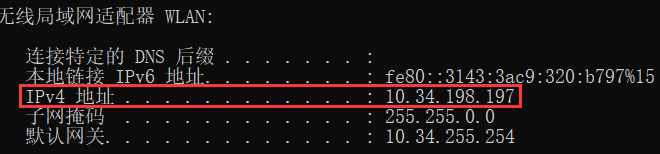
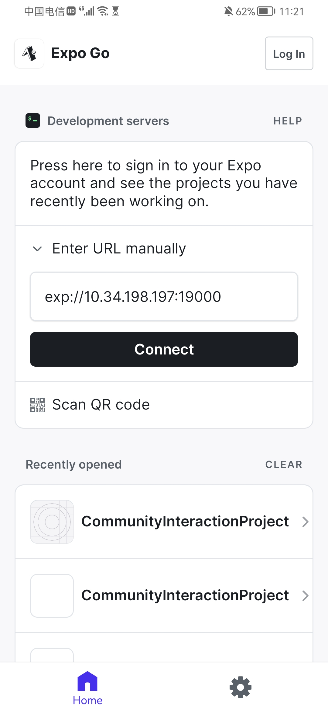
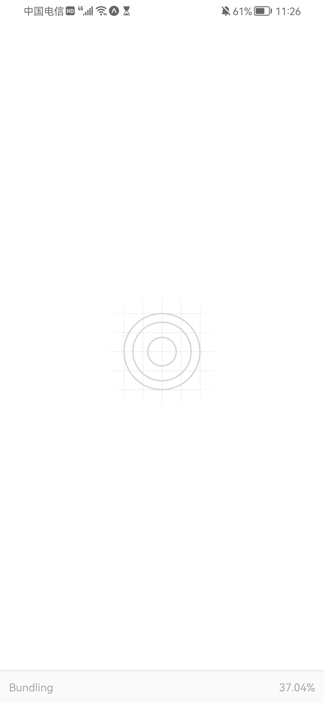

<p align="center"></p><br />
<p align="center">
  <a href="https://baike.baidu.com/item/X%2FMIT%E8%AE%B8%E5%8F%AF%E5%8D%8F%E8%AE%AE/10136122?fr=aladdin">
    
  </a>
  
  
</p>

此项目为互动社区 `APP` 的 `H5` 页面

# 准备

项目使用的 `yarn` 作为包管理器，请使用 `yarn` 安装 `npm` 包

```shell
yarn install
// 以下步骤不输入也可以用，但有什么奇怪问题可以试下
// 因为本项目的 react-native 版本大于 0.60 会自动链接
react-native link react-native-vector-icons
react-native link "react-native-safe-area-context
```

# 启动

## h5

终端输入以下命令，在浏览器中查看（默认链接为 `http://localhost:19006`）

```shell
expo start
// h5 (press keyborad)
w
```

## android or ios

1. 启动 `expo`

```shell
expo start
```

2. 打开 android or ios 设备的 Expo Go
    1. 如果没下载，请到一下应用商店下载
        1. ios: App Store【国区也有】
        2. Google play or APKPure
        3. 其它第三方应用商店或者部分网站 apk 包
3. 查看本地网络 `ipv4` 地址，并在 `Expo Go` 中输入 `exp://local_network_ipv4:19000`



### Android

`Android` 直接在应用中输入



默认启动过渡



### iOS

在备忘录中写入 `exp://local_network_ipv4:19000`，使用深链接（`Deep Link`）跳转至 `Expo Go` 并启动应用

示例和默认过渡态如下


## 注意事项

1. 不建议采用扫码的方式去启动 `Expo Go`，无论是 `Android` 还是 `iOS`，因为很难成功
2. 不建议采用打包 `.apk` 的方式安装运行，因为非常久

# 构建

目前只试水了正式的 `Android` 的 `.apk` 包

按照如下链接编译打包，[Expo Doc - Building APKs for Android emulators and devices](https://docs.expo.dev/build-reference/apk/)

每次打包预计 6-10 分钟，最终可得到一个链接，通过链接下载 `apk` 文件

TODO: 下次打包记得截图.jpg

# 提交规范

项目基于 `git flow` 管理项目提交，参考以下链接

[git-flow 的工作流程](https://www.git-tower.com/learn/git/ebook/cn/command-line/advanced-topics/git-flow)

## 提交信息规范

1. 更新/新增：`feat`
2. 重构：`chore`
3. 修复 `bug`：`fix`
4. 上线版本修复：`hotfix`

# TODO

1. 消除整个项目的行内样式

# 相关项目

1. 原生 `Android` 开发 `APP`，技术栈为 `java`，[content-chat-app](https://github.com/pandoralink/content-chat-app)
2. 基于上面那个原生 `Android`，迁移至 `React-Native + expo`
   跨端技术栈，[CommunityInteractionProject-expo](https://github.com/pandoralink/CommunityInteractionProject-expo)
3. 本项目适用于上面两个项目的 `H5`
   页面部分，[CommunityInteractionProject-H5](https://github.com/pandoralink/CommunityInteractionProject-H5)
